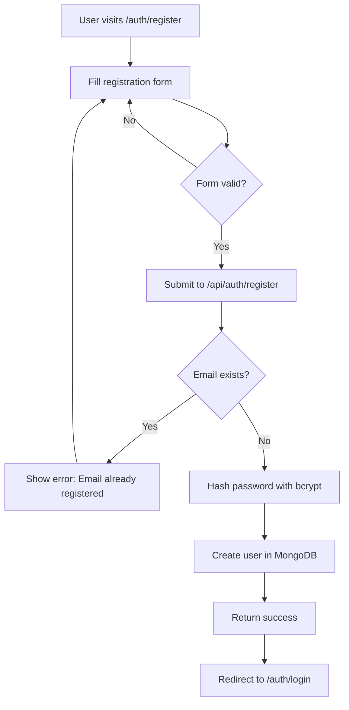
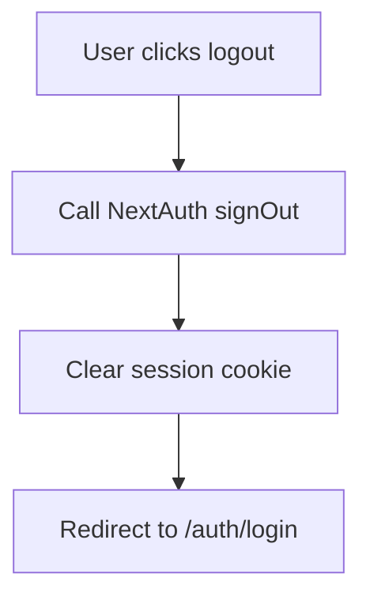
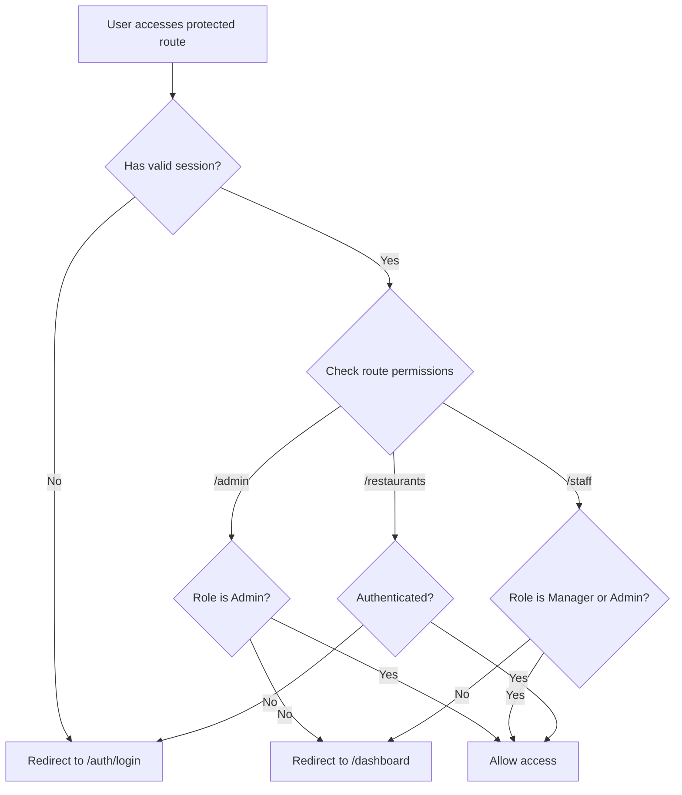
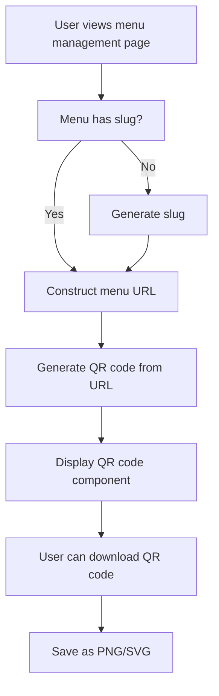

# Easy Restaurant - Workflow Documentation

## Table of Contents
1. [User Roles & Permissions](#user-roles--permissions)
2. [Authentication Workflow](#authentication-workflow)
3. [Restaurant Management Workflow](#restaurant-management-workflow)
4. [Menu Management Workflow](#menu-management-workflow)
5. [Order Management Workflow](#order-management-workflow)
6. [Customer Menu Viewing Workflow](#customer-menu-viewing-workflow)
7. [QR Code Generation & Sharing Workflow](#qr-code-generation--sharing-workflow)
8. [Admin Management Workflow](#admin-management-workflow)

---

## User Roles & Permissions

### Roles Overview

| Role | Description | Key Permissions |
|------|-------------|-----------------|
| **Owner** | Restaurant owner | Create restaurants, manage own restaurants, create menus, manage menus, assign managers |
| **Manager** | Restaurant manager | Manage assigned restaurants, create orders, update order status, view orders |
| **Admin** | System administrator | Manage all users, manage all restaurants, access admin panel, manage languages |
| **Customer** | Public user | View menus, place orders (via QR code) |

### Permission Matrix

```
┌─────────────────┬──────────┬──────────┬──────────┬──────────┐
│ Feature         │ Owner    │ Manager  │ Admin    │ Customer │
├─────────────────┼──────────┼──────────┼──────────┼──────────┤
│ Create Account  │    ✓     │    ✓     │    ✓     │    ✓     │
│ Create Restaurant│    ✓     │    ✗     │    ✓     │    ✗     │
│ Manage Restaurant│   Own    │ Assigned │   All    │    ✗     │
│ Create Menu     │    ✓     │    ✓     │    ✓     │    ✗     │
│ Manage Menu     │    ✓     │    ✓     │    ✓     │    ✗     │
│ Assign Managers │    ✓     │    ✗     │    ✓     │    ✗     │
│ Create Orders   │    ✓     │    ✓     │    ✓     │    ✓     │
│ Update Orders   │    ✓     │    ✓     │    ✓     │    ✗     │
│ View Orders     │    ✓     │    ✓     │    ✓     │   Own    │
│ View Menu       │    ✓     │    ✓     │    ✓     │    ✓     │
│ Manage Users    │    ✗     │    ✗     │    ✓     │    ✗     │
└─────────────────┴──────────┴──────────┴──────────┴──────────┘
```

---

## Authentication Workflow

### Registration Flow



**Steps:**
1. User navigates to `/auth/register`
2. User fills in registration form:
   - Name (required)
   - Email (required, must be unique)
   - Password (required, min length)
3. Form validation runs client-side
4. On submit, POST request to `/api/auth/register`
5. Server validates:
   - Email uniqueness
   - Password strength
   - Required fields
6. Password is hashed using bcrypt
7. User document created in MongoDB
8. Success response returned
9. User redirected to login page

### Login Flow

```mermaid
flowchart TD
    A[User visits /auth/login] --> B[Enter credentials]
    B --> C{Form valid?}
    C -->|No| B
    C -->|Yes| D[POST to /api/auth/[...nextauth]]
    D --> E{User exists?}
    E -->|No| F[Show error: Invalid credentials]
    E -->|Yes| G{Password correct?}
    G -->|No| F
    G -->|Yes| H[Create session with NextAuth]
    H --> I[Store user role in session]
    I --> J[Redirect to /dashboard]
    F --> B
```

**Steps:**
1. User navigates to `/auth/login`
2. User enters email and password
3. Form validation runs
4. POST request to NextAuth API route
5. Server validates credentials:
   - Find user by email
   - Compare password hash
6. If valid, create session token
7. Store user ID and role in session
8. Redirect based on role:
   - Owner/Manager → `/dashboard`
   - Admin → `/admin` or `/dashboard`

### Logout Flow



**Steps:**
1. User clicks logout button
2. NextAuth `signOut()` called
3. Session cookie cleared
4. Redirect to login page

### Protected Route Access



**Middleware Protection:**
- Routes protected by middleware: `/dashboard`, `/restaurants`, `/menus`, `/admin`, `/staff`
- Unauthenticated users redirected to `/auth/login`
- Role-based access control enforced

---

## Restaurant Management Workflow

### Create Restaurant Flow

```mermaid
flowchart TD
    A[Owner/Admin clicks Create Restaurant] --> B[Navigate to /restaurants/new]
    B --> C[Fill restaurant form]
    C --> D{Form valid?}
    D -->|No| C
    D -->|Yes| E[POST to /api/restaurants]
    E --> F[Validate user permissions]
    F --> G{Can create?}
    G -->|No| H[Return 403 Forbidden]
    G -->|Yes| I[Create restaurant in MongoDB]
    I --> J[Link restaurant to owner]
    J --> K[Return restaurant data]
    K --> L[Redirect to /restaurants/[id]]
    H --> C
```

**Steps:**
1. User (Owner/Admin) navigates to `/restaurants/new`
2. Fill restaurant form:
   - Name (required)
   - Address (required, can add multiple)
   - Contact information (phone, email)
   - Description (optional)
3. Form validation
4. POST to `/api/restaurants`
5. Server validates:
   - User authentication
   - User role (Owner or Admin)
6. Create restaurant document:
   - Set `owner` field to current user ID
   - Store restaurant data
7. Return created restaurant
8. Redirect to restaurant detail page

### View Restaurant List Flow

```mermaid
flowchart TD
    A[User visits /dashboard] --> B[GET /api/restaurants]
    B --> C{User role?}
    C -->|Admin| D[Fetch all restaurants]
    C -->|Owner| E[Fetch restaurants where owner = userId]
    C -->|Manager| F[Fetch restaurants where managers includes userId]
    D --> G[Display restaurant cards]
    E --> G
    F --> G
    G --> H[Click restaurant card]
    H --> I[Navigate to /restaurants/[id]]
```

**Steps:**
1. User navigates to `/dashboard`
2. Fetch restaurants based on role:
   - **Admin**: All restaurants
   - **Owner**: Restaurants where `owner === userId`
   - **Manager**: Restaurants where `managers` array includes `userId`
3. Display restaurant cards with:
   - Restaurant name
   - Address
   - Number of menus
   - Action buttons (Edit, View Menus, etc.)
4. Click card to view details

### Edit Restaurant Flow

```mermaid
flowchart TD
    A[User clicks Edit Restaurant] --> B[Navigate to /restaurants/[id]/edit]
    B --> C[GET restaurant data]
    C --> D{User can manage?}
    D -->|No| E[Redirect to /dashboard]
    D -->|Yes| F[Load form with existing data]
    F --> G[User modifies data]
    G --> H[Submit form]
    H --> I[PUT /api/restaurants/[id]]
    I --> J[Validate permissions]
    J --> K{Can update?}
    K -->|No| L[Return 403]
    K -->|Yes| M[Update restaurant in MongoDB]
    M --> N[Return updated data]
    N --> O[Redirect to /restaurants/[id]]
    L --> F
```

**Steps:**
1. User clicks "Edit" on restaurant detail page
2. Navigate to `/restaurants/[id]/edit`
3. Fetch restaurant data
4. Check permissions:
   - Owner can edit own restaurants
   - Manager can edit assigned restaurants
   - Admin can edit all restaurants
5. Load form with existing data
6. User modifies fields
7. Submit form → PUT `/api/restaurants/[id]`
8. Server validates and updates
9. Redirect to restaurant detail page

### Assign Manager Flow

```mermaid
flowchart TD
    A[Owner/Admin clicks Manage Managers] --> B[Navigate to /restaurants/[id]/managers]
    B --> C[GET current managers list]
    C --> D[Display manager assignment form]
    D --> E[Search/Select user to add]
    E --> F[POST /api/restaurants/[id]/managers]
    F --> G{User exists & valid?}
    G -->|No| H[Show error]
    G -->|Yes| I{Already manager?}
    I -->|Yes| H
    I -->|No| J[Add userId to managers array]
    J --> K[Update restaurant]
    K --> L[Refresh managers list]
    H --> D
```

**Steps:**
1. Owner/Admin navigates to `/restaurants/[id]/managers`
2. Display current managers
3. Search for user by email/name
4. Select user to add as manager
5. POST to `/api/restaurants/[id]/managers`
6. Server validates:
   - User exists
   - User not already a manager
   - Current user has permission
7. Add user ID to `managers` array
8. Update restaurant document
9. Refresh managers list

### Delete Restaurant Flow

```mermaid
flowchart TD
    A[User clicks Delete Restaurant] --> B[Show confirmation dialog]
    B --> C{User confirms?}
    C -->|No| D[Cancel]
    C -->|Yes| E[DELETE /api/restaurants/[id]]
    E --> F{User can delete?}
    F -->|No| G[Return 403]
    F -->|Yes| H[Delete restaurant]
    H --> I[Delete associated menus]
    I --> J[Delete associated menu items]
    J --> K[Delete associated orders]
    K --> L[Return success]
    L --> M[Redirect to /dashboard]
    G --> D
```

**Steps:**
1. User clicks "Delete Restaurant"
2. Show confirmation dialog
3. If confirmed, DELETE `/api/restaurants/[id]`
4. Server validates permissions
5. Cascade delete:
   - Delete restaurant
   - Delete all menus
   - Delete all menu items
   - Delete all orders
6. Return success
7. Redirect to dashboard

---

## Menu Management Workflow

### Create Menu Flow

```mermaid
flowchart TD
    A[User clicks Create Menu] --> B[Navigate to /restaurants/[id]/menus/new]
    B --> C[Fill menu form]
    C --> D{Form valid?}
    D -->|No| C
    D -->|Yes| E[POST /api/menus]
    E --> F[Validate restaurant permissions]
    F --> G{Can create?}
    G -->|No| H[Return 403]
    G -->|Yes| I[Generate unique slug]
    I --> J{Slug exists?}
    J -->|Yes| K[Append random string]
    J -->|No| L[Create menu document]
    L --> M[Link to restaurant]
    M --> N[Return menu data]
    N --> O[Redirect to /menus/[id]]
    H --> C
    K --> L
```

**Steps:**
1. User navigates to `/restaurants/[id]/menus/new`
2. Fill menu form:
   - Name (required)
   - Slug (auto-generated or manual, must be unique)
   - Description (optional)
3. Form validation
4. POST to `/api/menus`
5. Server validates:
   - User can manage restaurant
   - Slug uniqueness
6. Generate unique slug if not provided
7. Create menu document:
   - Link to restaurant
   - Set `slug` field
8. Return created menu
9. Redirect to menu management page

### Add Menu Item Flow

```mermaid
flowchart TD
    A[User clicks Add Item] --> B[Navigate to /menus/[id]/items/new]
    B --> C[Fill item form]
    C --> D{Form valid?}
    D -->|No| C
    D -->|Yes| E{Has image?}
    E -->|Yes| F[Upload to Cloudinary]
    E -->|No| G[POST /api/menus/[id]/items]
    F --> H[Get image URL]
    H --> G
    G --> I[Validate menu permissions]
    I --> J{Can add?}
    J -->|No| K[Return 403]
    J -->|Yes| L[Create menu item document]
    L --> M[Add to menu items array]
    M --> N[Return item data]
    N --> O[Redirect to /menus/[id]]
    K --> C
```

**Steps:**
1. User navigates to `/menus/[id]/items/new`
2. Fill item form:
   - Name (required)
   - Description (optional)
   - Price (required, numeric)
   - Category (optional, dropdown or text)
   - Image (optional, file upload)
3. If image provided:
   - Upload to Cloudinary
   - Get image URL
4. Form validation
5. POST to `/api/menus/[id]/items`
6. Server validates:
   - User can manage menu's restaurant
   - Required fields present
   - Price is valid number
7. Create menu item document
8. Add item to menu's `items` array
9. Return created item
10. Redirect to menu management page

### Edit Menu Item Flow

```mermaid
flowchart TD
    A[User clicks Edit Item] --> B[Navigate to /menus/[id]/items/[itemId]/edit]
    B --> C[GET menu item data]
    C --> D{User can manage?}
    D -->|No| E[Redirect to menu page]
    D -->|Yes| F[Load form with existing data]
    F --> G[User modifies data]
    G --> H{Image changed?}
    H -->|Yes| I[Upload new image]
    H -->|No| J[PUT /api/menus/[id]/items/[itemId]]
    I --> J
    J --> K[Validate permissions]
    K --> L{Can update?}
    L -->|No| M[Return 403]
    L -->|Yes| N[Update menu item]
    N --> O[Return updated data]
    O --> P[Redirect to /menus/[id]]
    M --> F
```

**Steps:**
1. User clicks "Edit" on menu item
2. Navigate to `/menus/[id]/items/[itemId]/edit`
3. Fetch menu item data
4. Check permissions
5. Load form with existing data
6. User modifies fields
7. If image changed, upload new image
8. Submit form → PUT `/api/menus/[id]/items/[itemId]`
9. Server validates and updates
10. Redirect to menu management page

### Delete Menu Item Flow

```mermaid
flowchart TD
    A[User clicks Delete Item] --> B[Show confirmation dialog]
    B --> C{User confirms?}
    C -->|No| D[Cancel]
    C -->|Yes| E[DELETE /api/menus/[id]/items/[itemId]]
    E --> F{User can delete?}
    F -->|No| G[Return 403]
    F -->|Yes| H[Remove item from menu]
    H --> I[Delete item document]
    I --> J[Return success]
    J --> K[Refresh menu page]
    G --> D
```

**Steps:**
1. User clicks "Delete" on menu item
2. Show confirmation dialog
3. If confirmed, DELETE `/api/menus/[id]/items/[itemId]`
4. Server validates permissions
5. Remove item from menu's `items` array
6. Delete menu item document
7. Return success
8. Refresh menu page

---

## Order Management Workflow

### Customer Place Order Flow

```mermaid
flowchart TD
    A[Customer scans QR code] --> B[View menu at /menu/[slug]]
    B --> C[Click Place Order]
    C --> D[Navigate to /menu/[slug]/order]
    D --> E[Select menu items]
    E --> F[Enter quantity for each item]
    F --> G[Add customer info]
    G --> H{Form valid?}
    H -->|No| G
    H -->|Yes| I[POST /api/orders]
    I --> J[Generate unique order number]
    J --> K[Calculate total price]
    K --> L[Create order document]
    L --> M[Set status: PENDING]
    M --> N[Return order with orderNumber]
    N --> O[Redirect to /orders/success]
    O --> P[Show order confirmation]
```

**Steps:**
1. Customer scans QR code or visits menu link
2. Views menu at `/menu/[slug]`
3. Clicks "Place Order" button
4. Navigates to `/menu/[slug]/order`
5. Selects menu items:
   - Click items to add to cart
   - Set quantity for each item
   - Add notes (optional)
6. Enters customer information:
   - Name (optional)
   - Phone (optional)
   - Table number (optional)
7. Form validation
8. POST to `/api/orders`
9. Server processes:
   - Generate unique order number (per restaurant)
   - Calculate total price
   - Create order document
   - Set status to `PENDING`
   - Link to restaurant and menu
10. Return order with `orderNumber`
11. Redirect to `/orders/success`
12. Display order confirmation with order number

### Staff Create Order Flow

```mermaid
flowchart TD
    A[Staff logs in] --> B[Navigate to /staff/dashboard]
    B --> C[Select restaurant]
    C --> D[Click Create Order]
    D --> E[Navigate to /restaurants/[id]/orders/new]
    E --> F[Select menu]
    F --> G[Select items and quantities]
    G --> H[Enter customer info]
    H --> I[POST /api/staff/orders]
    I --> J[Validate staff permissions]
    J --> K{Can create?}
    K -->|No| L[Return 403]
    K -->|Yes| M[Create order]
    M --> N[Assign to staff member]
    N --> O[Set status: PENDING]
    O --> P[Return order]
    P --> Q[Redirect to order detail]
    L --> E
```

**Steps:**
1. Staff member (Manager/Admin) logs in
2. Navigate to `/staff/dashboard` or restaurant orders page
3. Select restaurant
4. Click "Create New Order"
5. Navigate to `/restaurants/[id]/orders/new`
6. Select menu
7. Select items and set quantities
8. Enter customer information
9. POST to `/api/staff/orders`
10. Server validates:
    - User is Manager or Admin
    - User can manage restaurant
11. Create order:
    - Generate order number
    - Assign to current staff member
    - Set status to `PENDING`
12. Return order
13. Redirect to order detail page

### Update Order Status Flow

```mermaid
flowchart TD
    A[Staff views order] --> B[Select new status]
    B --> C{Status?}
    C -->|PREPARING| D[PUT /api/staff/orders/[orderId]]
    C -->|READY| D
    C -->|COMPLETED| D
    D --> E[Validate permissions]
    E --> F{Can update?}
    F -->|No| G[Return 403]
    F -->|Yes| H[Update order status]
    H --> I{Status = COMPLETED?}
    I -->|Yes| J[Set completedAt timestamp]
    I -->|No| K[Update order]
    J --> K
    K --> L[Return updated order]
    L --> M[Refresh order display]
    G --> B
```

**Order Status Flow:**
```
PENDING → PREPARING → READY → COMPLETED
```

**Steps:**
1. Staff views order list or detail page
2. Select new status from dropdown
3. PUT to `/api/staff/orders/[orderId]` or `/api/restaurants/[id]/orders/[orderId]`
4. Server validates:
   - User can manage restaurant
   - Valid status transition
5. Update order:
   - Set new status
   - If `COMPLETED`, set `completedAt` timestamp
   - Update `updatedAt`
6. Return updated order
7. Refresh order display

### View Orders Flow

```mermaid
flowchart TD
    A[User navigates to orders] --> B{User role?}
    B -->|Customer| C[GET /api/orders/[orderNumber]]
    B -->|Staff/Owner| D[GET /api/restaurants/[id]/orders]
    B -->|Staff| E[GET /api/staff/orders]
    C --> F[Display order details]
    D --> G[Filter by status]
    E --> G
    G --> H[Display order list]
    H --> I[Click order]
    I --> J[View order details]
```

**Customer View:**
1. Customer navigates to `/orders/track`
2. Enter order number
3. GET `/api/orders/[orderNumber]`
4. Display order details:
   - Order number
   - Items
   - Status
   - Total price
   - Timestamps

**Staff/Owner View:**
1. Navigate to `/restaurants/[id]/orders` or `/staff/dashboard`
2. GET orders for restaurant
3. Filter by status (optional)
4. Display order list with:
   - Order number
   - Customer info
   - Items summary
   - Status badge
   - Timestamps
5. Click order to view details

---

## Customer Menu Viewing Workflow

### QR Code Scan Flow

```mermaid
flowchart TD
    A[Customer scans QR code] --> B[QR code contains menu URL]
    B --> C[Navigate to /menu/[slug]]
    C --> D[GET menu data]
    D --> E{Menu exists?}
    E -->|No| F[Show 404 error]
    E -->|Yes| G[Fetch restaurant info]
    G --> H[Fetch menu items]
    H --> I[Group items by category]
    I --> J[Display menu]
    J --> K[Customer browses items]
    K --> L{Action?}
    L -->|Place Order| M[Navigate to /menu/[slug]/order]
    L -->|Continue Browsing| K
    F --> N[Show error message]
```

**Steps:**
1. Customer scans QR code with phone camera
2. QR code contains URL: `https://domain.com/menu/[slug]`
3. Browser navigates to menu page
4. Server fetches menu by slug:
   - Find menu in MongoDB
   - Populate restaurant data
   - Populate menu items
5. If menu not found, show 404 page
6. If found, display:
   - Restaurant name and info
   - Menu name
   - Menu items grouped by category
   - Item details (name, description, price, image)
7. Customer can:
   - Browse menu items
   - View item details
   - Click "Place Order" to create order

### Direct Link Access Flow

```mermaid
flowchart TD
    A[Customer receives menu link] --> B[Click link or type URL]
    B --> C[Navigate to /menu/[slug]]
    C --> D[Same as QR scan flow]
    D --> E[Display menu]
```

**Steps:**
1. Customer receives menu link (via email, SMS, etc.)
2. Clicks link or types URL
3. Same flow as QR code scan
4. Menu displayed

---

## QR Code Generation & Sharing Workflow

### Generate QR Code Flow



**Steps:**
1. User navigates to menu management page (`/menus/[id]`)
2. System checks if menu has slug
3. If no slug, generate unique slug
4. Construct full menu URL: `https://domain.com/menu/[slug]`
5. Generate QR code using `qrcode` library:
   - Input: Menu URL
   - Output: QR code image
6. Display QR code in sidebar or dedicated section
7. User can:
   - View QR code
   - Download as PNG
   - Download as SVG
   - Copy menu link

### Share Menu Link Flow

```mermaid
flowchart TD
    A[User clicks Share Menu] --> B[Display menu link]
    B --> C[Show copy button]
    C --> D[User clicks Copy]
    D --> E[Copy link to clipboard]
    E --> F[Show success message]
    F --> G[User can paste link]
    G --> H{Share method?}
    H -->|Email| I[Send via email]
    H -->|SMS| J[Send via SMS]
    H -->|Social Media| K[Share on platform]
```

**Steps:**
1. User clicks "Share Menu" or "Copy Link"
2. Display menu URL prominently
3. User clicks "Copy" button
4. JavaScript copies URL to clipboard
5. Show success toast: "Link copied!"
6. User can share via:
   - Email
   - SMS
   - Social media
   - Print QR code
   - Display QR code on screen

---

## Admin Management Workflow

### Manage Users Flow

```mermaid
flowchart TD
    A[Admin navigates to /admin] --> B[Click Users]
    B --> C[Navigate to /admin/users]
    C --> D[GET /api/admin/users]
    D --> E[Display user list]
    E --> F{Action?}
    F -->|Create| G[Navigate to /admin/users/new]
    F -->|Edit| H[Navigate to /admin/users/[id]/edit]
    F -->|Delete| I[Show confirmation]
    G --> J[Create user form]
    H --> K[Edit user form]
    I --> L{Confirmed?}
    L -->|Yes| M[DELETE /api/admin/users/[id]]
    L -->|No| E
    J --> N[POST /api/admin/users]
    K --> O[PUT /api/admin/users/[id]]
    M --> P[Refresh user list]
    N --> P
    O --> P
```

**Steps:**
1. Admin navigates to `/admin`
2. Click "Users" in navigation
3. Navigate to `/admin/users`
4. GET `/api/admin/users` - fetch all users
5. Display user list with:
   - Name
   - Email
   - Role
   - Actions (Edit, Delete)
6. **Create User:**
   - Navigate to `/admin/users/new`
   - Fill form
   - POST to `/api/admin/users`
7. **Edit User:**
   - Navigate to `/admin/users/[id]/edit`
   - Load user data
   - Modify fields
   - PUT to `/api/admin/users/[id]`
8. **Delete User:**
   - Click delete
   - Confirm action
   - DELETE `/api/admin/users/[id]`

### Manage Languages Flow

```mermaid
flowchart TD
    A[Admin navigates to /admin/languages] --> B[GET /api/admin/languages]
    B --> C[Display language settings]
    C --> D[Select default language]
    D --> E[Enable/disable languages]
    E --> F[PUT /api/admin/languages]
    F --> G[Update language settings]
    G --> H[Save to Settings model]
    H --> I[Refresh display]
```

**Steps:**
1. Admin navigates to `/admin/languages`
2. GET `/api/admin/languages` - fetch language settings
3. Display language management form:
   - List available languages
   - Set default language
   - Enable/disable languages
4. User modifies settings
5. PUT to `/api/admin/languages`
6. Update Settings document in MongoDB
7. Refresh display

---

## Error Handling & Edge Cases

### Common Error Scenarios

1. **Unauthenticated Access**
   - Redirect to `/auth/login`
   - Store intended destination for post-login redirect

2. **Unauthorized Access**
   - Return 403 Forbidden
   - Redirect to `/dashboard` with error message

3. **Invalid Menu Slug**
   - Show 404 page
   - Display "Menu Not Found" message
   - Provide link to home page

4. **Duplicate Slug**
   - Auto-generate alternative slug
   - Append random string or number

5. **Order Not Found**
   - Show error message
   - Allow re-entry of order number

6. **Image Upload Failure**
   - Show error message
   - Allow retry or skip image

7. **Network Errors**
   - Show retry button
   - Display user-friendly error message

---

## Data Flow Summary

### Request Flow Pattern

```
Client → Middleware → Route Handler → Database → Response
         ↓
    Auth Check
    Permission Check
    Validation
```

### Database Relationships

```
User (Owner)
  └── Restaurant (owner: User._id)
       ├── Menu (restaurant: Restaurant._id)
       │    └── MenuItem (menu: Menu._id)
       ├── Order (restaurant: Restaurant._id)
       └── Managers (managers: [User._id])
```

---

## API Endpoints Summary

### Authentication
- `POST /api/auth/register` - Register new user
- `POST /api/auth/[...nextauth]` - Login/Logout (NextAuth)

### Restaurants
- `GET /api/restaurants` - List restaurants (filtered by role)
- `POST /api/restaurants` - Create restaurant
- `GET /api/restaurants/[id]` - Get restaurant details
- `PUT /api/restaurants/[id]` - Update restaurant
- `DELETE /api/restaurants/[id]` - Delete restaurant
- `POST /api/restaurants/[id]/managers` - Assign manager

### Menus
- `GET /api/menus` - List menus
- `POST /api/menus` - Create menu
- `GET /api/menus/[id]` - Get menu details
- `PUT /api/menus/[id]` - Update menu
- `DELETE /api/menus/[id]` - Delete menu

### Menu Items
- `POST /api/menus/[id]/items` - Add menu item
- `GET /api/menus/[id]/items/[itemId]` - Get menu item
- `PUT /api/menus/[id]/items/[itemId]` - Update menu item
- `DELETE /api/menus/[id]/items/[itemId]` - Delete menu item

### Orders
- `POST /api/orders` - Create order (customer)
- `GET /api/orders/[orderNumber]` - Get order by number
- `GET /api/restaurants/[id]/orders` - List restaurant orders
- `PUT /api/restaurants/[id]/orders/[orderId]` - Update order
- `POST /api/staff/orders` - Create order (staff)
- `GET /api/staff/orders` - List staff orders
- `PUT /api/staff/orders/[orderId]` - Update order (staff)

### Admin
- `GET /api/admin/users` - List all users
- `POST /api/admin/users` - Create user
- `PUT /api/admin/users/[id]` - Update user
- `DELETE /api/admin/users/[id]` - Delete user
- `GET /api/admin/languages` - Get language settings
- `PUT /api/admin/languages` - Update language settings

---

## Security Considerations

1. **Authentication**
   - All protected routes require valid session
   - Passwords hashed with bcrypt
   - Session tokens stored securely

2. **Authorization**
   - Role-based access control (RBAC)
   - Resource-level permissions checked
   - Owner can only manage own resources (unless Admin)

3. **Input Validation**
   - Client-side validation for UX
   - Server-side validation for security
   - Sanitize user inputs
   - Validate file uploads

4. **Data Protection**
   - No sensitive data in URLs
   - Order numbers are unique per restaurant
   - User IDs never exposed to clients unnecessarily

---

## Performance Optimizations

1. **Database Indexing**
   - Restaurant owner index
   - Menu slug index (unique)
   - Order number + restaurant compound index
   - Order status index

2. **Caching**
   - Menu data can be cached (public pages)
   - Session data cached in memory

3. **Image Optimization**
   - Images uploaded to Cloudinary
   - Next.js Image component for optimization
   - Lazy loading for menu items

4. **Query Optimization**
   - Use `populate()` efficiently
   - Limit fields returned
   - Pagination for large lists

---

This workflow documentation provides a comprehensive guide to understanding how the Easy Restaurant application functions across all user roles and features.

